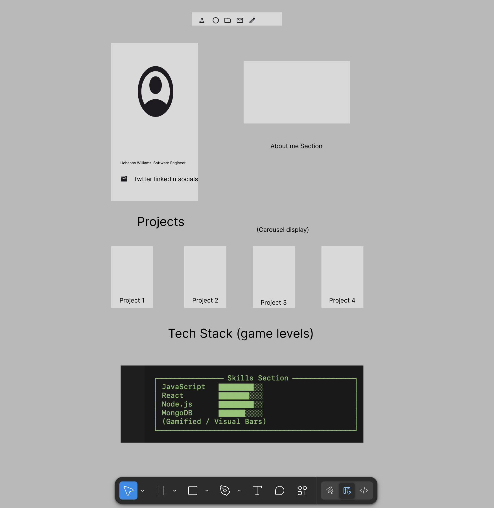

# Portfolio Website – Design & Feature Planning

## Overview

Out line for developer portfolio.

---

## Outlook of page

## Inspiration & Design References

### 1. Shahrukh Anwar – https://shahrukhanwar.vercel.app/

**Key takeaways:**

- Strong purple-based color theme that feels modern and bold
- Creative and visually engaging navigation bar
- Compact grid layout that presents content efficiently without feeling cluttered

---

### 2. Im Sezer – https://www.imsezer.com/

**Key takeaways:**

- Interactive display of frameworks and libraries
- Skill levels represented visually, giving a subtle “gamified” feel
- Clear separation of technologies while keeping the layout engaging

---

### 3. Nazmus Sayad – https://www.nazmussayad.com/

**Key takeaways:**

- Project showcase using a carousel for better visual storytelling
- Light mode and dark mode support
- Smooth transitions that enhance the overall user experience

---

## Core Features (Planned)

- Responsive navigation bar with a creative visual style
- Purple-accented theme with consistent color usage
- Light mode / dark mode toggle
- Project showcase using a carousel component
- Skills section with visual indicators of proficiency
- Compact grid layouts for projects and content
- Fully responsive design for mobile, tablet, and desktop
- Clean typography and accessible UI components

---
